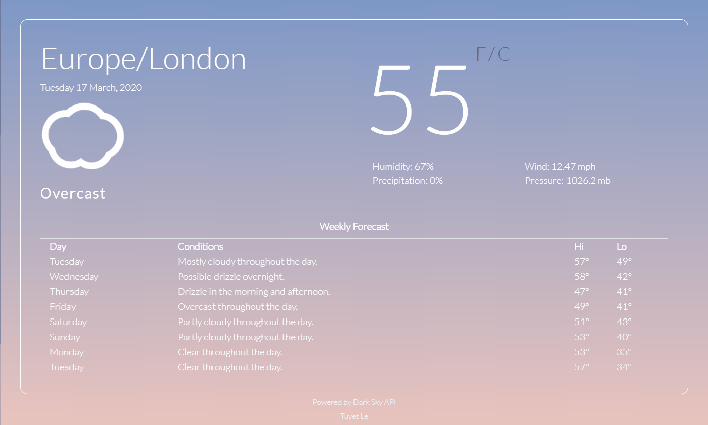

# Local Weather-App :sunny::umbrella::cloud:

## About
This project was built to continue my learning of JavaScript and on how to fetch data from a web API. 

This is a simple weather app pulling the user's current local weather and the weekly forecast. This project fetches data from the [Dark Sky API](https://darksky.net/dev). The user has the option to view the current temperature in Celsius or Fahrenheit. Additional data displayed include the humidity, wind, precipitation and pressure. 

